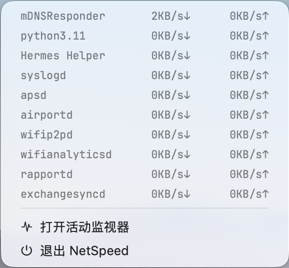

# NetSpeed

> macOS 菜单栏实时网速监控小工具 —— 显示上传/下载速率，点开查看 Top10 进程流量。
> A lightweight macOS menu bar app that shows live upload/download speed on the status bar and per-process traffic on click.


## ✨ 功能

- **状态栏实时网速**：`↑上传 / ↓下载` 两行，每 2 秒刷新一次。
- **智能单位与精度**：KB/s 整数；`1.0~9.9MB/s` 保留 1 位小数；`≥10MB/s` 与 GB/s 用整数；状态栏预留宽度固定（不跳动、不加宽）。
- **Top10 进程流量**：点击状态栏展开菜单，按总流量排序显示前 10 个进程的上传/下载速度（方向箭头 `↓`/`↑` 与状态栏一致）。
- **菜单对齐像素级**：进程名、速度列、底部"打开活动监视器 / 退出 NetSpeed"在同一竖线；底部两项使用**系统原生高亮蓝条**与原生点击，各带一枚原生 **SF Symbols 图标**（波形 `waveform.path.ecg` / 电源 `power`），悬停时图标与文字自动变白。
- **轻量、无 Xcode**：单文件 Swift + `swiftc` 编译，ad-hoc 签名，不依赖额外框架。
- **状态栏图标**：自带 macOS 风格应用图标（基于素材生成 `.icns`）。

## 🖼 菜单



状态栏显示 `119KB/s↑ / 2.4MB/s↓` 这类读数（KB/s 整数、小数值保留 1 位小数）；点开后是一个按流量排序的 Top10 进程列表，底部两行前各有一枚原生 SF Symbols 图标（波形 = 打开活动监视器、电源 = 退出 NetSpeed），悬停蓝条时图标与文字自动变白。

> 图标使用 SF Symbols，需要 macOS 11+（`LSMinimumSystemVersion` 已设为 12.0）。

## 🔧 环境要求

- macOS 12.0+
- Xcode Command Line Tools（提供 `swiftc`、`codesign`、`iconutil`）
  ```bash
  xcode-select --install
  ```

## 📦 构建 & 运行

```bash
./build.sh
open NetSpeed.app
```

`build.sh` 会：
1. 用 `swiftc -O` 编译 `main.swift`；
2. 组装 `NetSpeed.app` 包，并拷入 `Info.plist`；
3. 由仓库里的 `Assets/AppIcon.iconset/` 用 `iconutil` 生成 `AppIcon.icns` 并放入应用资源；
4. ad-hoc 签名。

构建产物 `NetSpeed.app` / `NetSpeed` / `AppIcon.icns` 不会被提交（见 `.gitignore`）。


### 📀 打包 .dmg 安装包

```bash
./make_dmg.sh


基于 `build.sh` 产出的 `NetSpeed.app` 自动打出一个 `NetSpeed.dmg`（UDZO 压缩），卷内自带指向 `/Applications` 的 **Applications** 链接——打开后把应用拖进去即完成安装。产物 `NetSpeed.dmg` 同样不提交（见 `.gitignore`）。
## 🚀 使用方法

1. 运行后，状态栏出现网速读数（两个箭头分别表示上传/下载）。
2. 点击读数展开菜单，查看 Top10 进程的实时流量。
3. 菜单底部：
   - **打开活动监视器** —— 打开系统"活动监视器"。
   - **退出 NetSpeed** —— 退出应用。
4. 刷新周期固定 2 秒，可在 `main.swift` 的 `refreshInterval` 调整。

## 🛠 实现要点

- **总网速采样**：`sysctl(NET_RT_IFLIST2)` 直接读取物理网卡 `en*` 的 64 位累计收发字节数，两次采样做差除以间隔得到速率；通过过滤 `en*`（数字后缀）排除 `lo0`/`utun`/`awdl` 等，避免 VPN（如 ClashX TUN）造成双重计数。路由消息按 `msglen` 紧凑排列，Swift 中用字节拷贝（`readLE`）读取避免未对齐 UB。
- **Top10 进程流量**：每轮调用 `nettop -P -L 1 -x -n` 获取各进程累计入/出字节，与上一次快照做差求速度；在后台线程执行，不阻塞主线程。
- **状态栏渲染**：把上下两行文字画成 `NSImage`，文字右对齐、箭头贴右缘固定，并显式设 `statusItem.length` 消除系统默认 padding，保证宽度恒定不跳动。
- **菜单对齐**：菜单是比例字体环境，用"真实渲染宽度"（`NSAttributedString` 实测像素宽）补空格对齐各列；底部功能项为系统 `NSMenuItem`，用前导空格使其与进程名首列在同一竖线。

## 📁 项目结构

```
NetSpeed/
├── main.swift            # 全部源码（采样/格式化/状态栏渲染/菜单/定时刷新）
├── build.sh              # 一键构建脚本（swiftc + 打包 + icns + ad-hoc 签名）
├── Info.plist            # 应用元数据（LSUIElement 状态栏应用）
├── Assets/
│   └── AppIcon.iconset/  # 图标源多尺寸 PNG（构建时生成 icns）
├── docs/screenshots/     # README 截图
├── .github/workflows/    # 构建 CI
└── .gitignore
```

## 📄 License

Released under the [MIT License](LICENSE).

## 🙏 致谢

- 图标素材由 [作者] 制作。
