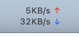
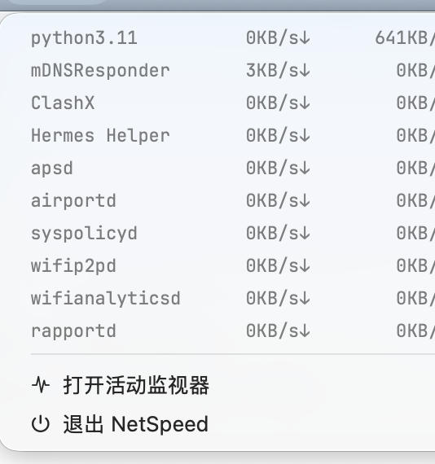

# NetSpeed

> macOS 菜单栏实时网速监控小工具 —— 显示上传/下载速率，点开查看 Top10 进程流量。
> A lightweight macOS menu bar app that shows live upload/download speed on the status bar and per-process traffic on click.



## ✨ 功能

- **状态栏实时网速**：`↑上传 / ↓下载` 两行，每 2 秒刷新一次。
- **智能单位与精度**：KB/s 整数；`1.0~9.9MB/s` 保留 1 位小数；`≥10MB/s` 与 GB/s 用整数；状态栏预留宽度固定（不跳动、不加宽）。
- **Top10 进程流量**：点击状态栏展开菜单，按总流量排序显示前 10 个进程的上传/下载速度（方向箭头 `↓`/`↑` 与状态栏一致）。
- **计入 AirDrop/接力流量**：统计口径含 `awdl0`（隔空投送、接力、随航的专用直连链路），AirDrop 传文件时状态栏总速度与进程列表中的 `sharingd` 口径一致。
- **菜单对齐像素级**：进程名、速度列、底部"打开活动监视器 / 退出 NetSpeed"在同一竖线；底部两项使用**系统原生高亮蓝条**与原生点击，各带一枚原生 **SF Symbols 图标**（波形 `waveform.path.ecg` / 电源 `power`），悬停时图标与文字自动变白。
- **轻量、无 Xcode**：单文件 Swift + `swiftc` 编译，ad-hoc 签名，不依赖额外框架。

## 🖼 菜单



状态栏显示 `119KB/s↑ / 2.4MB/s↓` 这类读数（KB/s 整数、小数值保留 1 位小数）；点开后是一个按流量排序的 Top10 进程列表，底部两行前各有一枚原生 SF Symbols 图标（波形 = 打开活动监视器、电源 = 退出 NetSpeed），悬停蓝条时图标与文字自动变白。

> 图标使用 SF Symbols，需要 macOS 11+（`LSMinimumSystemVersion` 已设为 12.0）。

## 🔧 环境要求

- macOS 12.0+
- Xcode Command Line Tools（提供 `swiftc`、`codesign`、`iconutil`、`hdiutil`）
  ```bash
  xcode-select --install
  ```

## 📦 构建

```bash
./build.sh              # 默认本机架构 (arm64)
./build.sh x86_64       # Intel 版（macOS 12.0+，Rosetta 下也可运行 arm64 版）
./build.sh universal    # arm64 + x86_64 + universal 三份
```

产物统一输出到 `dist/<arch>/NetSpeed.app`：

| 目录 | 架构 | 适用 |
|---|---|---|
| `dist/arm64/` | Apple Silicon | M1/M2/M3/M4/M5 及之后 |
| `dist/x86_64/` | Intel | 2012~2020 Intel Mac |
| `dist/universal/` | 双架构合并 | 一份 .app 通吃两种 Mac |

`build.sh` 会：
1. 用 `swiftc -O -target <arch>-apple-macos12.0` 编译 `main.swift`；
2. 组装 `NetSpeed.app` 包，拷入 `Info.plist` 与仓库根目录的 `AppIcon.icns`；
3. 写入版本号（见下节）；
4. ad-hoc 签名。

## 🔖 版本号

版本号由 `build.sh` 在组装 `.app` 时自动写入，**不要在 `Info.plist` 里手动维护**（那里只是无 tag 时的兜底值）：

| 字段 | 来源 | 示例 |
|---|---|---|
| `CFBundleShortVersionString` | 最近的 git tag（去掉 `v`）| `v1.1` → `1.1` |
| `CFBundleVersion` | `git rev-list --count HEAD`（提交数，单调递增）| `7` |
| `NetSpeedGitDescribe` | `git describe --tags --always --dirty`（追溯用）| `v1.1-3-g3cbad4d-dirty` |

发版流程：改代码 → 提交 → `git tag v1.2` → `./package_release.sh`，产物即自报 `1.2`；
未打 tag 的构建会沿用 `Info.plist` 现值，构建号仍随提交数递增，因此同版本的不同构建也能区分。

查看已安装版本的版本号：

```bash
defaults read /Applications/NetSpeed.app/Contents/Info.plist CFBundleShortVersionString
defaults read /Applications/NetSpeed.app/Contents/Info.plist NetSpeedGitDescribe
```

> CI 中 `actions/checkout` 已设 `fetch-depth: 0`，否则拿不到 tag 与提交数。

## 🚀 发布（GitHub 发布物）

```bash
./package_release.sh    # 编译两架构 + zip + dmg + SHA256SUMS 一条龙
```

产出 `dist/release/`：

```
dist/release/
├── NetSpeed-<版本>-arm64.zip   # Apple Silicon 直装包（解压即用，分发首选）
├── NetSpeed-<版本>-x86_64.zip  # Intel 直装包
├── NetSpeed-<版本>-arm64.dmg   # 安装镜像（拖拽安装）
├── NetSpeed-<版本>-x86_64.dmg
└── SHA256SUMS.txt              # 校验和
```

以当前版本为例即 `NetSpeed-1.1-arm64.dmg`。

单独打 dmg：`./make_dmg.sh [arch]`（依赖 `dist/<arch>/NetSpeed.app` 已存在），dmg 卷内自带指向 `/Applications` 的链接，拖进去即完成安装。

> `.build/` 与 `dist/` 为构建产物，已加入 `.gitignore`，不入库。

## 🖼 更换应用图标

1. 用新的 `.icns` 覆盖仓库根目录的 `AppIcon.icns`；
2. 同步更新图标源（保持两者一致）：
   ```bash
   iconutil -c iconset AppIcon.icns -o Assets/AppIcon.iconset
   ```
3. 重新 `./build.sh`。若仓库中缺 `AppIcon.icns`，构建脚本会自动从 `Assets/AppIcon.iconset/` 重新生成。

## 🚀 使用方法

1. 运行后，状态栏出现网速读数（两个箭头分别表示上传/下载）。
2. 点击读数展开菜单，查看 Top10 进程的实时流量。
3. 菜单底部：
   - **打开活动监视器** —— 打开系统"活动监视器"。
   - **退出 NetSpeed** —— 退出应用。
4. 刷新周期固定 2 秒，可在 `main.swift` 的 `refreshInterval` 调整。

## 🛠 实现要点

- **总网速采样**：`sysctl(NET_RT_IFLIST2)` 读取网卡累计收发字节数，两次采样做差除以间隔得到速率。统计口径为 `en*` 物理网卡 **+ `awdl0`**（AirDrop/接力/随航专用直连链路）；排除 `utun*`（VPN 如 ClashX TUN 的流量已在底层物理网卡计过，避免双重计数）与 `lo0`/`llw0`/`bridge0`/`anpi*`。路由消息按 `msglen` 紧凑排列，Swift 中用字节拷贝（`readLE`）读取避免未对齐 UB。
- **计数器回绕**：macOS 26 内核把接口字节计数器按 32 位写入（高 32 位恒为 0），累计值在 4.29GB（2³²）处回绕；且消息结构从 160B 变为 180B（新增字段在尾部，`ibytes@+96`/`obytes@+104` 偏移未变）。速度差分统一用 `wrapDelta32()` 低 32 位回绕减法，只要单次采样间隔流量 < 4.29GB 结果就完全正确（也兼容老系统真 64 位计数器）。
- **Top10 进程流量**：每轮调用 `nettop -P -L 1 -x -n` 获取各进程累计入/出字节，与上一次快照做差求速度；在后台线程执行，不阻塞主线程。进程统计与接口无关，因此 AirDrop 由 `sharingd` 承载、会出现在列表中。注意 nettop 的进程累计值是真 64 位但**不单调**（连接关闭时统计会回退），做差需钳位为 0。
- **状态栏渲染**：把上下两行文字画成 `NSImage`，文字右对齐、箭头贴右缘固定，并显式设 `statusItem.length` 消除系统默认 padding，保证宽度恒定不跳动。
- **菜单对齐**：菜单是比例字体环境，用"真实渲染宽度"（`NSAttributedString` 实测像素宽）补空格对齐各列；底部功能项为系统 `NSMenuItem`，用前导空格使其与进程名首列在同一竖线。

## 🔍 调试

```bash
dist/arm64/NetSpeed.app/Contents/MacOS/NetSpeed --debug-bytes
# 输出 rx=... tx=...（累计字节数），可与 `netstat -ib` 的 en*+awdl0 合计对账。
# 注意 macOS 26 上该值会在 4.29GB 处回绕（内核行为），对账请比较差分而非绝对值。
```

## 📁 项目结构

```
NetSpeed/
├── main.swift            # 全部源码（采样/格式化/状态栏渲染/菜单/定时刷新）
├── build.sh              # 构建脚本（支持 arm64/x86_64/universal 参数）
├── make_dmg.sh           # 打包 .dmg 安装镜像（hdiutil）
├── package_release.sh    # 一键产出 GitHub 发布物（zip + dmg + SHA256，文件名带版本）
├── Info.plist            # 应用元数据（LSUIElement 状态栏应用；版本号由 build.sh 覆写）
├── AppIcon.icns          # 应用图标（与 Assets/AppIcon.iconset 同源）
├── Assets/
│   └── AppIcon.iconset/  # 图标源多尺寸 PNG
├── dist/                 # 构建产物（不入库）
│   ├── arm64|x86_64|universal/NetSpeed.app
│   └── release/          # GitHub 发布物（zip/dmg/SHA256SUMS.txt）
├── docs/screenshots/     # README 截图
├── .github/workflows/    # 构建 CI（package_release.sh 工件上传）
└── .gitignore
```

## 📜 更新日志

- **1.1（2026-09-17）**：修复 `beginActivity` 选项误用 `.userInitiated` 导致整机永不空闲睡眠的问题（改为 `.userInitiatedAllowingIdleSystemSleep`，并在退出时成对调用 `endActivity`）；版本号改由 `build.sh` 从 git tag 自动写入，发布物文件名带版本号。
- **2026-09-16**：总网速计入 `awdl0`（修复 AirDrop/接力流量不显示）；修复计数器 4.29GB 回绕导致的速度显示假 0（接口与进程两处差分均改为回绕减法）；新增 `--debug-bytes` 调试开关；构建脚本支持架构参数，产物统一到 `dist/`；换用新图标；新增 x86_64/universal 构建。

## 📄 License

Released under the [MIT License](LICENSE).

## 🙏 致谢

- 图标素材由 [作者] 制作。
